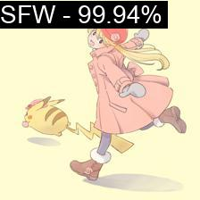

# NSFW Anime Arts Classification

This project simply classifies whether anime artworks is **SFW** or **NSFW**

## Environments

- Python 3.10.9
- torch 1.13.1
- torchvision 0.14.1

Install requirements

``` bash
pip install -r requirements.txt
```

## Data

- I get my data from gelbooru and safebooru. You can use your own data or crawl from internet, you can google and try on your own.

- Data in this format

``` files
|-- data
    |-- train
    |   |-- class 1
    |   |-- class 2
    |   `-- ...
    `-- valid
        |-- class 1
        |-- class 2
        `-- ...
```

### Config

Modify config in `./cfg/config.yaml` or create your own `.yaml` config file with the same format.

### Train

Simply run 

``` bash
python train.py --cfg ./cfg/config.yaml
```

### Experiment Results

Some experiment results

| Model | Training Info | Epoch | Best Accuracy | Pretrained | Model size |
| --- |:---:| :---: | :---: | :---: |
| Regnet_X_800MF | Adam, lr=**1e-4** to **1e-6** | 100 | 94.78% | [Model](https://drive.google.com/file/d/1xQDr3NVkyqMf3wDdPBpMScyuBO73VyLn/view?usp=share_link) | 27.96MB |

You can download weight file above and put in `weights` folder and run inference

``` bash
python infer.py
```

#### Some inference results

- SFW Image



- NSFW Image 

You can try on your own :wink: